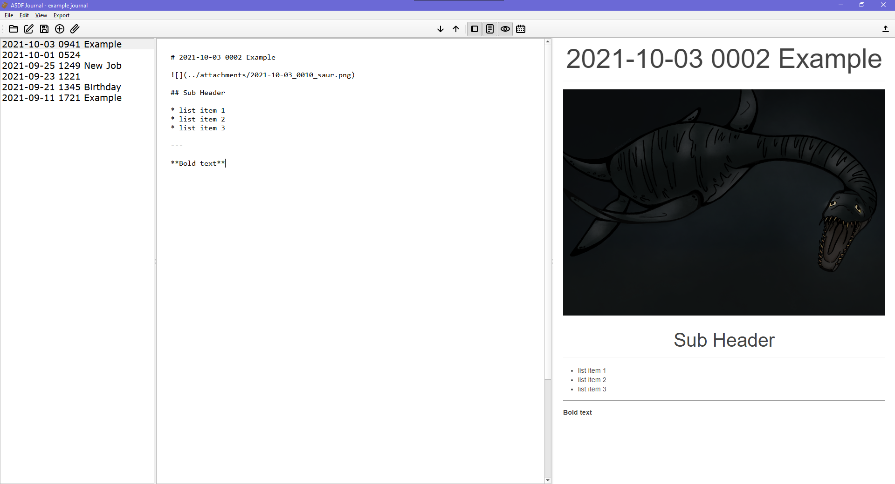
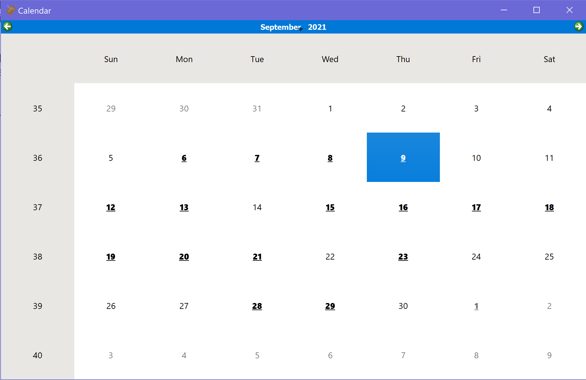

# ASDF Journal
A simple journal which uses markdown formatting

## Features

### Future Proof

* Journal entries are stored in plain text markdown files
* Journal file names start with a YYYY-MM-DD_HHMM timestamp so that sorting by name also sorts by date
* Plain text files will likely be readable for a long time while other propietary formats can become obsolete

### Live HTML Preview

See your entries rendered in HTML as you type

### Calendar

See which days have at least one entry and select a day to view that entry

### Other Features

* Add attachments to your entries
  * Attachments are also timestamped with YYYY-MM-DD_HHMM
  * Attachments are stored in a single folder and can be easily linked from multiple entries
* Export your journal as a single markdown file
* Supports extra markdown features such as tables and footnotes

## Installation

### Windows

* Download the zip file from the latest [release](https://github.com/Rohitjagan/ASDF-Journal/releases)
* Unzip and run the executable
* *ASDF-Journal* can be used as a portable application

### Linux & macOs

* Clone the ASDF-Journal directory
* Run asdf-journal.py
* See dependencies

### Dependencies

**The following libraries are needed:**

* PyQt5
* PyQtWebEngine
* Python-Markdown
